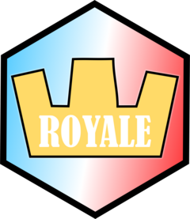

<!-- README.md is generated from README.Rmd. Please edit that file -->

```{r, include = FALSE}
knitr::opts_chunk$set(
  collapse = TRUE,
  comment = "#>",
  fig.path = "man/figures/README-",
  out.width = "100%"
)
```

# royale 

<!-- badges: start -->
[](https://github.com/christopherkenny/royale/actions/workflows/R-CMD-check.yaml)
[](https://christopherkenny.r-universe.dev/royale)
[](https://lifecycle.r-lib.org/articles/stages.html#stable)
<!-- badges: end -->

`royale` provides an R interface to the [Clash Royale API](https://developer.clashroyale.com/#/).

## Installation

You can install the development version of `royale` from [GitHub](https://github.com/) with:

``` r
# install.packages("devtools")
devtools::install_github("christopherkenny/royale")
```

## Example

Current endpoints are included for cards, rankings, tournaments, players, and clans.

To get a player's data, we can use:
```{r}
library(royale)

cr_get_player('JYJQC88')
```

To get a clan, we can use:

```{r}
clan <- cr_get_clan('99R2PQVR')
clan
```
Clans are put into long form, so each player in a clan is an observation:
```{r}
clan |> 
  dplyr::relocate(dplyr::starts_with('player'), .before = dplyr::everything())
```


## RoyaleAPI Proxy

If you are using a RoyaleAPI proxy, this can be configured by setting `options(royale.use_proxy = TRUE)`.
This can be turned off by setting `options(royale.use_proxy = FALSE)`. It is off by default.


## Disclaimer

**This content is not affiliated with, endorsed, sponsored, or specifically approved by Supercell and Supercell is not responsible for it. For more information see Supercell’s Fan Content Policy: <www.supercell.com/fan-content-policy>.**

